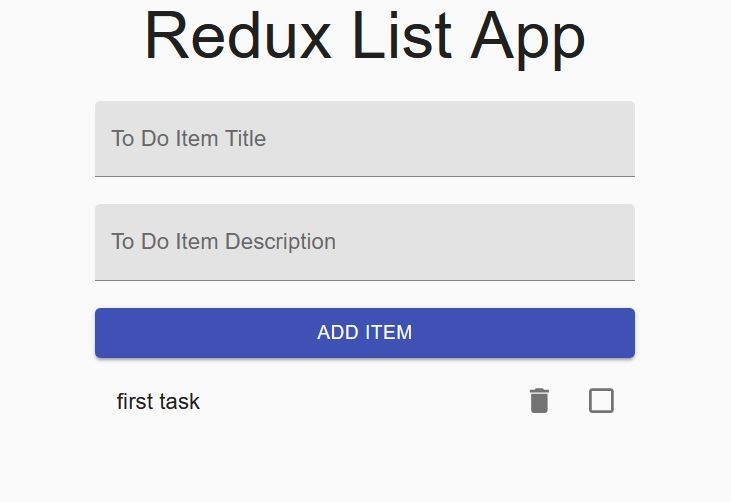
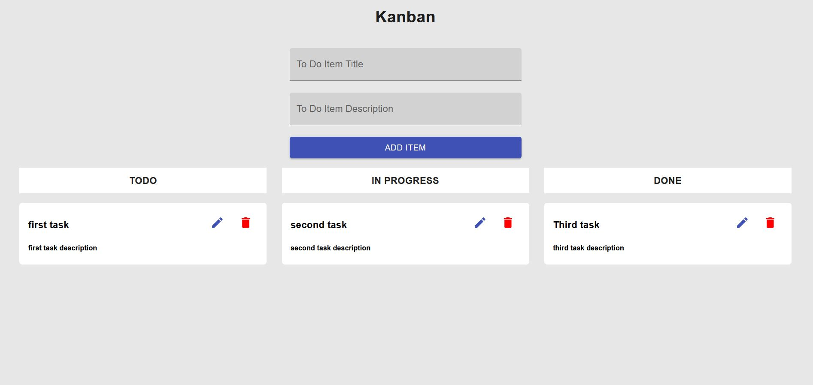

# About The Project
This projet is a persistent Redux TodoList and a kanban with DnD tasks
# Get Started
### Prerequires
* npm

### Installation
This is the way you can get the project
1. Clone the project
```
git clone .....
```
2. Go into the folder
```
cd redux-todo-list
```
3. Install packages
```
npm install
```
or 
```
npm install --legacy-peer-deps
```

### Usage
This is the way you can get the project
1. Run the server
```
npm start
```
2. Now the servet is started, open [mainRoot](http://localhost:3000) to use the todoList
3. Open [kanbanRoot](http://localhost:3000/tasks) to use the kanban
#### TodoList usage

You can create a new task by filling the `Title` fileld with a non-empty title. The description is optional and must not exceed 200 characters. Then click on `ADD ITEM` button and the task apear. <br/><br/>
You can now remove the task by clicking on the delete button or mark this task complete by clicking on the checkbox.<br/>
#### Kanban usage

You can create a task following the **TodoList usage** tutorial.<br/>
You can also **delete** a task by clicking on the delete button associated to this task.<br/><br/>
You can modify a task by clicking on the edit button associated to the task. A modal apear and you must modify all informations on the task before clicking on `Modify`.<br/>
If you don't want to edit your task, exit the modal by clicking on `Cancel`.<br/><br/>
You can finally drag and drop each task to the column you want and to the position you want in the column.


# Technologies
this project has been realised in:<br/>
* react
* typescript
* redux
* ui-material library